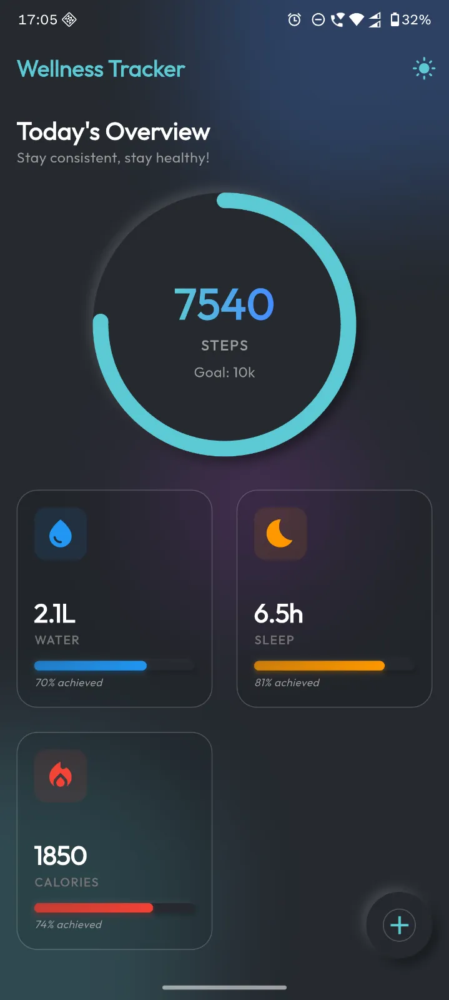
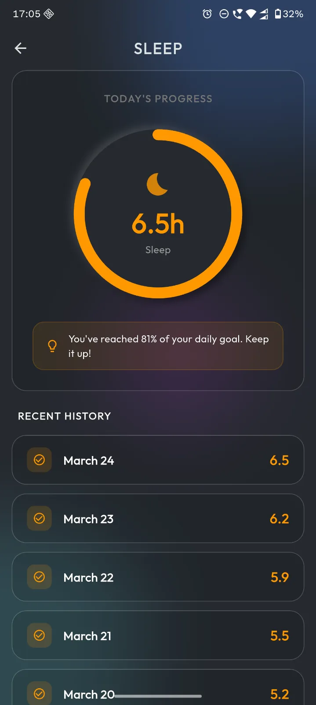
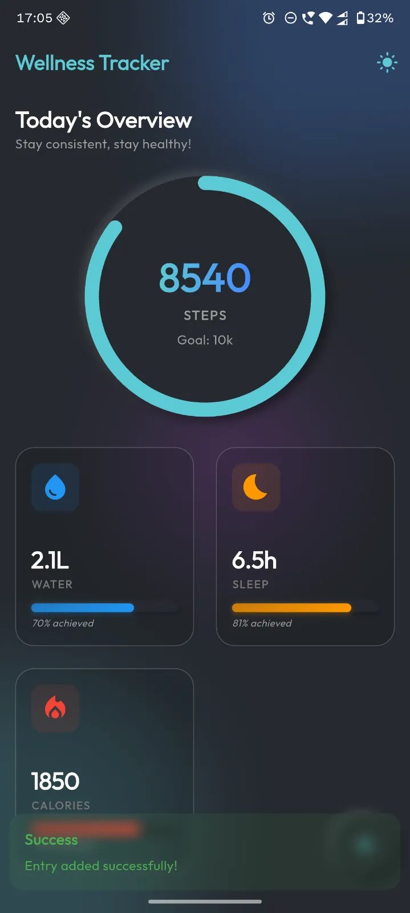

# Wellness Tracker

A production-ready, beautiful, and fully responsive Wellness Tracking App built with Flutter. This project showcases a modern **Neomorphic (Soft UI)** and **Glassmorphic** design system, utilizing clean architecture and GetX for state management.

## Key Features
- **Responsive Layout**: Designed to look stunning across mobile phones, tablets, and desktop dimensions.
- **Dark & Light Themes**: Dynamic themes equipped with high-contrast vibrant accents tailored for both environments.
- **Fluid Animations**: Meaningful hero animations, implicit transitions, and interactive bouncing behaviors on metric changes.
- **Slick State Management**: Leverages GetX controllers for robust reactive programming uncoupled from UI bloat.
- **Glassmorphism**: Stunning frosted glass cards overlaying ambient glowing orbs.

## App Showcase

| Screenshot 1 | Screenshot 2 | Screenshot 3 |
|:---:|:---:|:---:|
|  |  |  |

## Reusable UI Components
The application features a fully modularized design system located in `lib/presentation/widgets/`. These ready-to-use custom widgets allow you to effortlessly build new screens following the Neomorphic aesthetic:

- **`NeoCard`**: A versatile container offering either soft Neomorphic drop shadows (outset) or a pure frosted Glassmorphic effect (`isGlass: true`).
- **`NeoButton`**: An animated, interactive Neomorphic button that morphs its shadows when pressed to simulate depth.
- **`NeoTextField`**: A softly recessed input field using inner shadows for a debossed (engraved) appearance.
- **`NeoCircularProgress`**: A cleanly painted circular gauge to track metrics, featuring a smooth gradient sweep and glowing thumb limit indicators.
- **`NeoProgressBar`**: A linear, recessed progress bar with inner shadows and an animated filling gradient.
- **`NeoBackground`**: A global underlying layer that provides soft, blurred, glowing ambient orbs—specifically designed to sit beneath the application's scaffold and make transparent `isGlass` cards pop brilliantly.

## Setup Instructions

1. Clone the repository.
2. Ensure you have Flutter installed and configured.
3. Run `flutter pub get` to fetch dependencies (GetX, Google Fonts, Responsive Framework).
4. Run `flutter run` to launch on your connected device or emulator.
